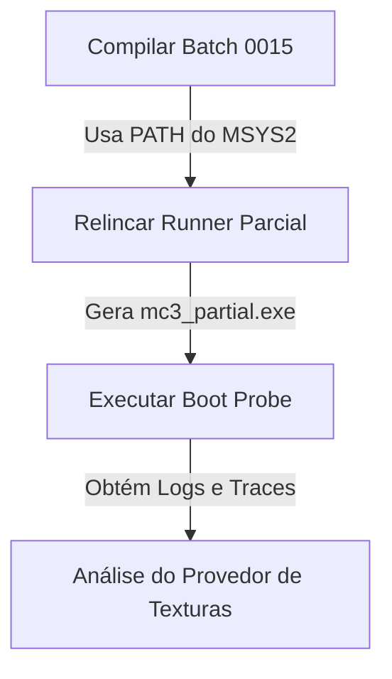

# Plano de Execução - Compilação de Lote 15 e Resolução do Loop 0x2B4488

Este plano detalha as etapas recomendadas para resolver os problemas de ambiente e compilação do lote `batch_0015`, possibilitar a linkagem do executável parcial do Midnight Club 3 (`mc3_partial.exe`) e diagnosticar o loop de espera ocupada (spin lock) no endereço `0x2b4488`.

## 1. Contexto e Diagnóstico Atual

Atualmente, o projeto Midnight Club 3 Recomp está bloqueado por duas frentes:
1. **Bloqueio de Build (Frente Fria):** Faltam compilar 8 funções geradas no `batch_0015` para gerar seus respectivos arquivos `.o`. Isso impede a execução do script de relinkagem `10_link_partial_runner.bat`, deixando o executável parcial defasado ou inexistente.
2. **Bloqueio de Execução (Frente Quente):** O runner parcial, quando executado, entra em um loop infinito de spin lock no PC `0x2b4488` (em `sub_002B4438_0x2b4438`). Esse loop é acionado porque uma chamada a uma tabela virtual (`obj->vtable + 0x24`, resolvida como `sub_00429FC0_0x429fc0`) retorna `0` (null). A falha no retorno deve-se a erros de abertura de pacotes/arquivos de textura (como `texture.zip` em `0x4f9760` retornando `handle = 0xffffffff`).

---

## 2. Ações Propostas e Justificativas

O plano de ação está dividido em 4 etapas lógicas:



### Etapa 1: Compilação das Funções Restantes do `batch_0015`
* **Ação:** Executar a compilação incremental de objetos para o `batch_0015` injetando o caminho do MSYS2 UCRT64 no `PATH`.
* **Comando:**
  ```powershell
  $env:PATH='C:\msys64\ucrt64\bin;' + $env:PATH; .\09_compile_generated_batch.bat batch_0015 250 object
  ```
* **Justificativa:** Sem a compilação dessas funções, a linkagem do runner falha devido a símbolos ausentes. O compilador GCC/cc1plus necessita do caminho da toolchain no PATH para não falhar silenciosamente.

### Etapa 2: Linkagem do Runner Parcial (`mc3_partial.exe`)
* **Ação:** Executar o script de linkagem para atualizar o executável com as novas funções compiladas e os stubs corretos.
* **Comando:**
  ```bat
  10_link_partial_runner.bat
  ```
* **Justificativa:** Consolida todos os objetos compilados e gera um novo executável nativo atualizado com os metadados de PC alias gerados a partir do código descompilado.

### Etapa 3: Execução do Boot Probe com Tracing Ativo
* **Ação:** Executar o script de análise automatizada com os argumentos de trace e patches compatíveis previamente estabelecidos.
* **Comando:**
  ```bat
  15_auto_boot_probe.bat 6 payload1m3skip5a
  ```
* **Justificativa:** Permite capturar as saídas de debug em tempo de execução e registrar o trace estruturado sob os arquivos de log para validar se a alteração do runner mudou o PC de bloqueio.

### Etapa 4: Investigação Estática/Dinâmica da Falha de Abertura em `0x4f9760`
* **Ação:** Analisar e instrumentar as variáveis de controle do provedor de pacotes, especificamente:
  * O estado de inicialização em `sub_004FAED8_0x4faed8` e `sub_004F9A68_0x4f9a68`.
  * As flags globais `0x629f40` e `0x629f41` que controlam a abertura dos pacotes.
  * O encadeamento de fallback (`0x629f4c`).
* **Justificativa:** O retorno nulo no vtable slot `+0x24` de `0x6d557c` é causado diretamente pela falha no provedor em abrir os pacotes `/texture.zip`. Devemos descobrir se o estado do provedor foi corrompido ou se o arquivo físico não está acessível no caminho esperado pelo runner.

---

## 3. Plano de Verificação

### Testes Automatizados
* Validar que todas as 250 funções de `batch_0015` foram compiladas verificando se o arquivo de sumário `work\compile\ghidra\batch_0015\batch_0015.object.summary.csv` não possui falhas.
* Validar que o executável `mc3_partial.exe` foi criado ou atualizado na pasta `work\link\partial\`.

### Verificação Manual
* Iniciar o boot probe e checar o arquivo `work\boot_probe\latest_status.md`.
* Inspecionar o log de boot trace `work\logs\14_run_boot_trace.log` procurando ocorrências de `handle=0xffffffff` em requisições de arquivos ou erros de inicialização de pacotes.
* Comparar, via PCSX2-MCP (se conectado), os valores de memória reais dos ponteiros de provedor no endereço `0x006D557C` e adjacentes no momento em que o jogo real atinge a tela de título.
